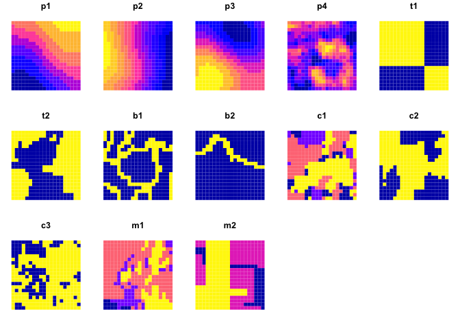
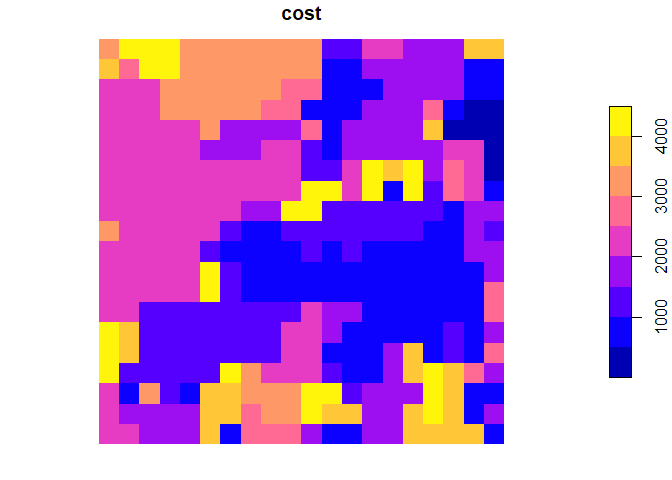
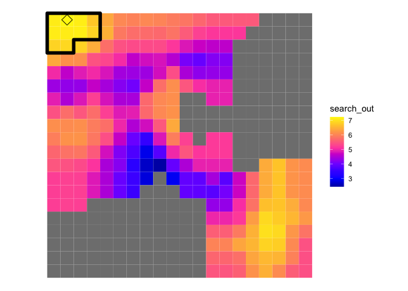

Patchmax
================
Pedro Belavenutti & Cody Evers

<!--- README.md is generated from README.Rmd. Please edit that file -->


## Description

Patchmax is a computational module designed to explore spatially
explicit landscape treatment projects. The package can be used to
prioritize treatment locations on relatively small landscapes (project
level implementation, 1,000 ha) to large landscapes (national forests to
multi-regional planning efforts, 1 million ha). Although patchmax was
originally designed for hazardous fuel treatment planning in forested
systems, it can be applied to fiber production, habitat restoration, and
other resource management problems. Patchmax utilizes Djistra’s
algorithm to sequence stands within the projects based on both adjacency
and distance, which is modified according to the model parameters.

Dependences: R (\>= 4.0.3) and packages (igraph, data.table, sf,
doParallel, parallel, spdep, pbapply)

## Installation

The current official version of the *patchmax* package can be installed
from [GitHub](https://github.com/forsys-sp/patchmax/).

``` r
if (!require(remotes)) install.packages("remotes")
remotes::install_github("forsys-sp/patchmax")
```

## Usage

Stand treatment units are represented as polygons in a spatial vector
format. Each polygon represents a different treatment unit.

``` r
library(patchmax)
pm <- patchmax$new(...)
pm$area_max = 1200
pm$search()$build()$record()
```

First, let’s load some example data and map the included fields. To keep
things simple, we focus only a subset of the entire study area.

``` r
library(dplyr)
```

    ## 
    ## Attaching package: 'dplyr'

    ## The following object is masked from 'package:patchmax':
    ## 
    ##     sample_frac

    ## The following objects are masked from 'package:stats':
    ## 
    ##     filter, lag

    ## The following objects are masked from 'package:base':
    ## 
    ##     intersect, setdiff, setequal, union

``` r
library(sf)
```

    ## Linking to GEOS 3.10.2, GDAL 3.4.1, PROJ 7.2.1; sf_use_s2() is TRUE

``` r
geom <- patchmax::test_forest %>% 
  filter(row > 20, row <= 40, col > 20, col <= 40)

geom %>% 
  select(matches('p[0-9]|t[0-9]|b[0-9]|m[0-9]|c[0-9]')) %>%
  plot(max.plot = 20, border=NA)
```

<!-- -->

We can combined these data to create additional fields. For example,
let’s create a new field called cost, which we’ll use later as a
secondary constraint building patches.

``` r
geom <- geom %>% mutate(cost = ((p2 + p4 - c1) * 1000) + 3000)
plot(geom[,'cost'], border=NA)
```

<!-- -->

Patchmax is written as R6 class, which uses a slightly different syntax
the functional programming design used in most R functions. To use
patchmax, we first create a patchmax object called `pm` using the new
method in the patchmax_generator class. `print(pm)` shows how the object
is structured into public and private components. Several of the public
elements are called active bindings, which is used to get and set
private elements under very specific conditions. The private elements
cannot be directly access or changed from the outside.

``` r
pm <- patchmax$new(
  geom = geom, 
  id_field = 'id', 
  objective_field = 'p4', 
  area_field = 'ha', 
  area_max = 1000)
```

The core purpose of patchmax is build spatially contiguous patches that
maximizes some objective given some maximum size constraint. The example
below shows how this is done over a series of steps: (1) patchmax
searches for the best place, (2) builds that patch, (3) plots the patch,
(4) records the patch, (5) describes the patch statistics.

``` r
pm$search()
pm$build()
pm$plot()
```

<!-- -->

``` r
pm$record()
pm$summarize()
```

    ## # A tibble: 1 x 3
    ##   patch_id    p4    ha
    ##      <dbl> <dbl> <dbl>
    ## 1        1  8.75  1000

Note that the same set of sequence of steps can be chained together into
a single line: `pm$search()$build$plot()$record()$summarize()`, which
shows how multiple actions can be combined in different ways to produce
different results.

## Simulating multiple projects

We can also run patchmax to simulate a set number of projects based on
our pm object.

``` r
# First reset results
pm$reset()
```

    ## All patches reset

``` r
# Simulate 10 projects and summarize results
pm$simulate(10)
```

    ## Searching 100% of stands...

    ## Best seed: 2732

    ## Patch stats: seed 2732, obj 8.8, area 1000, coverage 1000, constraint 1000, excluded 0%

    ## Patch 1 recorded

    ## Searching 100% of stands...

    ## Best seed: 3629

    ## Patch stats: seed 3629, obj 8, area 1000, coverage 1000, constraint 1000, excluded 0%

    ## Patch 2 recorded

    ## Searching 100% of stands...

    ## Best seed: 2835

    ## Patch stats: seed 2835, obj 7.4, area 1000, coverage 1000, constraint 1000, excluded 0%

    ## Patch 3 recorded

    ## Searching 100% of stands...

    ## Best seed: 2022

    ## Patch stats: seed 2022, obj 7.2, area 1000, coverage 1000, constraint 1000, excluded 0%

    ## Patch 4 recorded

    ## Searching 100% of stands...

    ## Best seed: 3637

    ## Patch stats: seed 3637, obj 7, area 1000, coverage 1000, constraint 1000, excluded 0%

    ## Patch 5 recorded

    ## Searching 100% of stands...

    ## Best seed: 2830

    ## Patch stats: seed 2830, obj 6.4, area 1000, coverage 1000, constraint 1000, excluded 0%

    ## Patch 6 recorded

    ## Searching 100% of stands...

    ## Best seed: 3731

    ## Patch stats: seed 3731, obj 6.3, area 1000, coverage 1000, constraint 1000, excluded 0%

    ## Patch 7 recorded

    ## Searching 100% of stands...

    ## Best seed: 3238

    ## Patch stats: seed 3238, obj 6.3, area 1000, coverage 1000, constraint 1000, excluded 0%

    ## Patch 8 recorded

    ## Searching 100% of stands...

    ## Best seed: 2923

    ## Patch stats: seed 2923, obj 6.2, area 1000, coverage 1000, constraint 1000, excluded 0%

    ## Patch 9 recorded

    ## Searching 100% of stands...

    ## Best seed: 2635

    ## Patch stats: seed 2635, obj 6.1, area 1000, coverage 1000, constraint 1000, excluded 0%

    ## Patch 10 recorded

``` r
pm$summarize()
```

    ## Joining, by = "id"

    ## # A tibble: 10 x 3
    ##    patch_id    p4    ha
    ##       <dbl> <dbl> <dbl>
    ##  1        1  8.75  1000
    ##  2        2  8.02  1000
    ##  3        3  7.41  1000
    ##  4        4  7.22  1000
    ##  5        5  6.98  1000
    ##  6        6  6.41  1000
    ##  7        7  6.31  1000
    ##  8        8  6.33  1000
    ##  9        9  6.17  1000
    ## 10       10  6.07  1000

## Studies

Belavenutti, Pedro, Alan A. Ager, Michelle A. Day, and Woodam Chung.
2022. Designing forest restoration projects to optimize the application
of broadcast burning. Ecological Economics 201. doi:
10.1016/j.ecolecon.2022.107558.

Belavenutti, Pedro, Alan. A. Ager, Michelle A. Day, and Woodam Chung.
2022. Multi-objective scheduling of fuel treatments to implement a
linear fuel break network. Fire 6:1. doi: 10.3390/fire6010001.

## Citation

Please cite the *patchmax* package when using it in publications. To
cite the current official version, please use:

> Evers C, Belavenutti P, Day M, Houtman R, and Ager A. (2023).
> Patchmax: a spatial optimization package for building spatial
> priorities.. R package version 0.2.. Available at
> <https://github.com/forsys-sp/patchmax>.

## Getting help

If you have any questions about the *patchmax* package or suggestions
for improving it, please [post an issue on the code
repository](https://github.com/forsys-sp/patchmax/issues/new).
