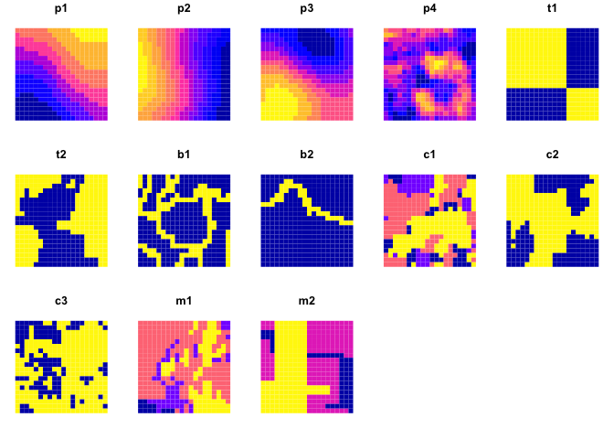

Patchmax
================
Pedro Belavenutti & Cody Evers

<!--- README.md is generated from README.Rmd. Please edit that file -->


## Description

Patchmax is a computational module designed to explore spatially
explicit landscape treatment projects. The package can be used to
prioritize treatment locations on relatively small landscapes (project
level implementation, 1,000 ha) to large landscapes (national forests to
multi-regional planning efforts, 1 million ha). Although patchmax was
originally designed for hazardous fuel treatment planning in forested
systems, it can be applied to fiber production, habitat restoration, and
other resource management problems. Patchmax utilizes Djistra’s
algorithm to sequence stands within the projects based on both adjacency
and distance, which is modified according to the model parameters.

Dependences: R (\>= 4.0.3) and packages (igraph, data.table, sf,
doParallel, parallel, spdep, pbapply)

## Installation

The latest official version of the Patchmax package can be installed
from GitHub using the following code after we provide your personal
access token.

``` r
if (!require(remotes)) install.packages("remotes")
remotes::install_github("forsys-sp/patchmax", auth_token = 'your_token_here')
```

## Usage

Stand treatment units are represented as polygons in a spatial vector
format. Each polygon represents a different treatment unit.

``` r
library(patchmax)

pm <- patchmax_generator$new(...)

pm$area_max = 1200

pm$search()$build()$record()
```

First, let’s load some example data and map the included fields. To keep
things simple, we focus only a subset of the entire study area.

``` r
library(dplyr)
library(sf)

geom <- patchmax::test_forest %>% 
  filter(row > 20, row <= 40, col > 20, col <= 40)

geom %>% 
  select(matches('p[0-9]|t[0-9]|b[0-9]|m[0-9]|c[0-9]')) %>%
  plot(max.plot = 20, border=NA)
```

<!-- -->

We can combined these data to create additional fields. For example,
let’s create a new field called cost, which we’ll use later as a
secondary constraint building patches.

``` r
geom <- geom %>% mutate(cost = ((p2 + p4 - c1) * 1000) + 3000)
plot(geom[,'cost'], border=NA)
```

<!-- -->

## Studies

Belavenutti, Pedro, Alan A. Ager, Michelle A. Day, and Woodam Chung.
2022. Designing forest restoration projects to optimize the application
of broadcast burning. Ecological Economics.
