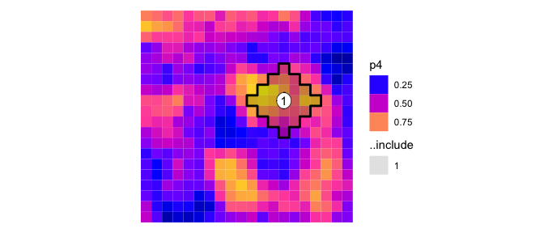
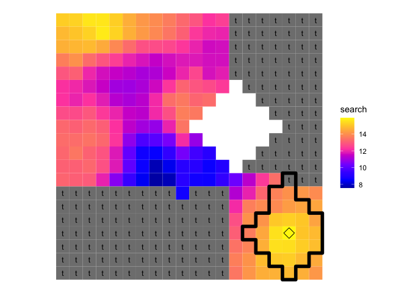

Patchmax
================

<!--- README.md is generated from README.Rmd. Please edit that file -->


Patchmax is a computational module designed to explore spatially
explicit landscape treatment projects. The package can be used to
prioritize treatment locations on relatively small landscapes (project
level implementation, 1,000 ha) to large landscapes (national forests to
multi-regional planning efforts, 1 million ha). Although patchmax was
originally designed for hazardous fuel treatment planning in forested
systems, it can be applied to fiber production, habitat restoration, and
other resource management problems. This version of Patchmax is based on
a R6 objects and utilizes Djistra’s algorithm to sequence stands within
patches based on both adjacency and distance.

*Dependences: R (\>= 4.0.3) and packages (R6, igraph, dplyr, sf, furrr,
purrr, proxy, cppRouting)*

## Installation

Patchmax package can be installed from GitHub using the following code.

``` r
if (!require(remotes)) install.packages("remotes")
remotes::install_github("forsys-sp/patchmax")
```

## Usage

Stand treatment units are represented as polygons in a spatial vector
format. Each polygon represents a different treatment unit with numerous
attributes that can be used to prioritize or constrain patch
construction. To start, let’s load some example data included with
patchmax. To keep things simple, we focus only a subset of the entire
study area. Further below, we’ll set up a scenairo where we create
several patches in sequence that maximize priority *p4* up to a patch
size of 1000 ha and a maximum cost of \$50000

``` r
library(dplyr)
library(sf)
library(purrr)

geom <- patchmax::test_forest %>% 
  filter(row > 20, row <= 40, col > 20, col <= 40)

geom %>% 
  select(matches('p[0-9]|t[0-9]|b[0-9]|m[0-9]|c[0-9]')) %>%
  plot(max.plot = 20, border=NA)
```

<!-- -->

We can combined these data to create additional fields. For example,
let’s create a new field called cost, which we’ll use later as a
secondary constraint building patches. In this example, treatment costs
range between 500 and 5000 dollars per 100 ha stand.

``` r
geom <- geom %>% mutate(cost = ((p2 + p4 - c1) * 1000) + 3000)
plot(geom[,'cost'], border=NA)
```

<!-- -->

Patchmax is written as R6 class, which uses a syntax that differs from
functional programming design used in most R functions. We first create
a patchmax object called `pm` using the `new` method in the `patchmax`
class and specify five base parameters that required in every Patchmax
run: the stand geometry, the fields names for the stand id, objective,
and area, and finally the maximum area allowed in a patch.

``` r
pm <- patchmax$new(
  geom = geom, 
  id_field = 'id', 
  objective_field = 'p4', 
  area_field = 'ha', 
  area_max = 1000)
```

The core purpose of patchmax is build spatially contiguous patches that
maximizes some objective given some maximum size constraint. The example
below shows how this is done over a series of steps: (1) patchmax
searches for the best place, (2) builds that patch, (3) plots the patch,
(4) records the patch, (5) describes the patch statistics.

``` r
pm$search()
pm$build()
pm$record()
pm$plot()
```

<!-- -->

Note that the same set of sequence of steps can be chained together into
a single line: `pm$search()$build()$plot()`. This is a distinct feature
of R6 class objects that works similar to piping `|>`.

To get a better sense of how the patch is selected, let’s look at the
search results in more detail. The plot below shows the patch scores
using each stand as a potential seed. Note how the stands recorded in
the previous patch are excluded. While the search plot looks similar to
stand plot of the priority `p4`, the values represent the potential
objective score of a patch if it were built from that location. In this
sense, patchmax works similar to a moving window spatial analysis

``` r
pm$search(search_plot = T)
```

<!-- -->

Next we’ll change a few additional parameters and see how this affects
the search. Notice how two large blocks of the landscape are excluded
due to the new treatment threshold.

``` r
pm$threshold = 't1 == 1'
pm$search(search_plot = T)
```

<!-- -->

Next, let’s add a secondary constraint that limits the overall cost of
each patch to 15000. Note how this suppresses the search_out scores
substantially; many of the potential patch locations that were able to
produce high quality patches are now blue. This change is the result of
the new cost constraint limiting patch sizes in many areas of the
landscape from growing more than a few stands in size, hence the lower
scores.

``` r
pm$constraint_field = 'cost'
pm$constraint_max = 15000
pm$search(search_plot = T)
```

<!-- -->

Adding a minimum patch size constrains potential projects further and
removes additional sections of the landscape from consideration since no
viable patches exist.

``` r
pm$area_min = 500
pm$search(search_plot = T)
```

<!-- -->

As a final step, we’ll reset the patchmax run and use the simulate
method to identify the 10 highest prioirty patches given the area, cost
and threshold constraints.

``` r
pm$reset()
pm$simulate(10)
pm$plot()
```

<!-- -->

``` r
pm$patch_stats
```

    ##    patch_id seed area coverage objective constraint excluded
    ## 1         1 2933  800     1000       6.7      14200       20
    ## 2         2 3438 1000     1000       6.7      12420        0
    ## 3         3 2432 1000     1000       5.1      14430        0
    ## 4         4 2033  900     1200       4.8      14890       25
    ## 5         5 3733  800     1200       4.5      14390       33
    ## 6         6 3030  900      900       4.3      14940        0
    ## 7         7 3235  900     1400       4.1      14370       36
    ## 8         8 3840  800      800       4.0      13850        0
    ## 9         9 2529  700      700       4.0      14640        0
    ## 10       10 2923  600      600       3.9      14300        0

## Getting help

If you have any questions about the *patchmax* package or suggestions
for improving it, please [post an issue on the code
repository](https://github.com/forsys-sp/patchmax/issues/new).

## Studies

Patchmax builds on an earlier implementation as described in Belavenutti
et al. 2022 which pioneered the use of network search algorithms to
prioritize patches. The current version was rewritten as an R6 object
class and uses Dijstra’s algorithm over breath first search in
evaluating patches.

Belavenutti, Pedro, Alan A. Ager, Michelle A. Day, and Woodam Chung.
2022. Designing forest restoration projects to optimize the application
of broadcast burning. Ecological Economics.s
